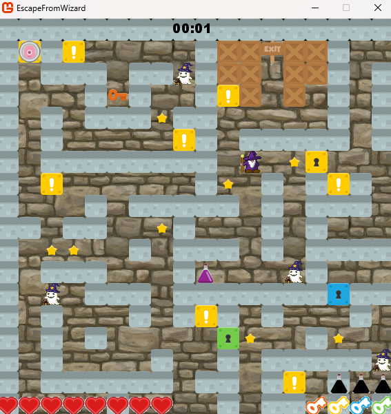
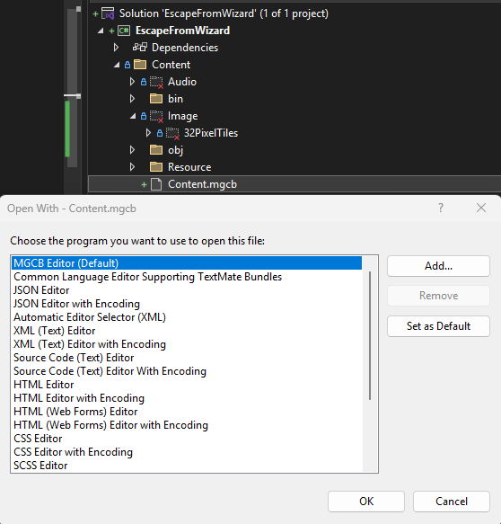
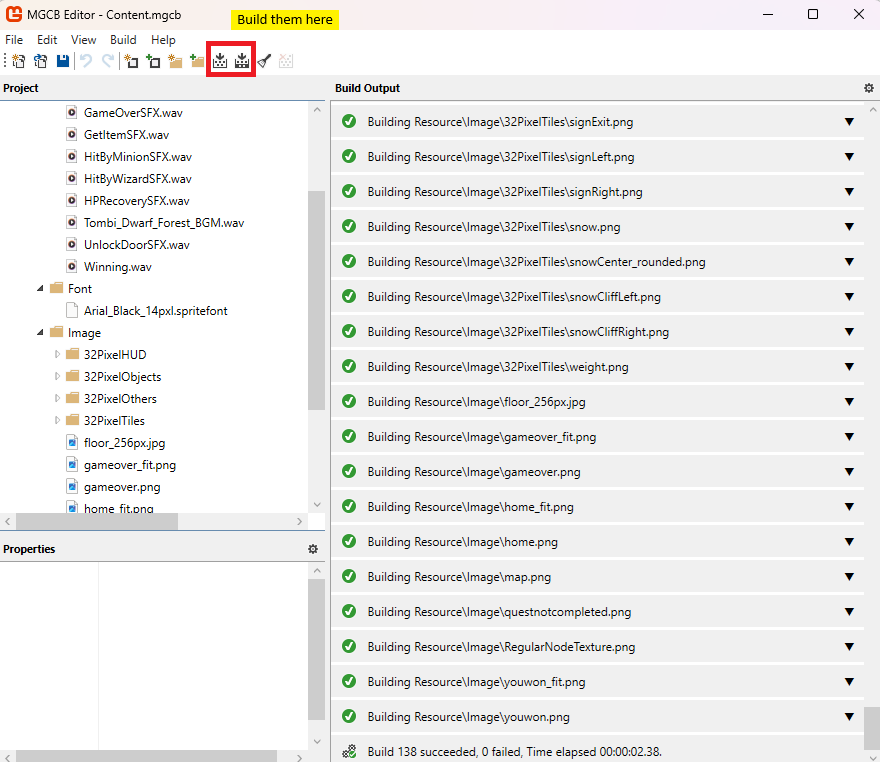
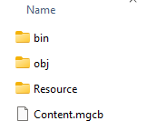

# Escape From Wizard
Escape from Wizard is a C# project I've made during University Course `Game Algorithm Design and Analysis` using [Microsoft XNA 4.0](https://en.wikipedia.org/wiki/Microsoft_XNA_Game_Studio#:~:text=Microsoft%20XNA%20Game%20Studio%20is,on%20the%20Microsoft%20XNA%20platform.) framework. It is featuring A* algorithm implementation for the path searching.

It was initially using Microsoft XNA framework which tied to VS2015. It is now upgraded to VS2022 with [MonoGame](https://monogame.net/) and now it is runnable.

    

## Coding Quality Disclaimer
Since the project is done in 2015, the code quality is no longer reflecting my code skills and is considered as a legacy project. 
Unless there is an absolute needs for it to be redone, else it is not likely to get polished to demonstrates good quality of code. 
It'll only get refactored over time if there is no other priority in life.

## Setting Up
Unfortunately, this is not the kind of project can be download and run directly. I have excluded most of the buildable binaries files from this project as best practices. One must setup the environment properly to run this project.

Please go thru the following setup documentation:

[Setting up your OS for development](https://docs.monogame.net/articles/getting_started/1_setting_up_your_os_for_development_windows.html?tabs=android)

[Setting up Visual Studio on Windows](https://docs.monogame.net/articles/getting_started/2_choosing_your_ide_visual_studio.html)

## Compiling Content 
After upgrade from Microsoft XNA 4.0, the old method of loading resources is no longer working. Hence, you must link the resources using MGCB and build them on your machine. 

Refer to: 
[Generating XNB files](https://www.trccompsci.online/mediawiki/index.php/Generating_and_using_XNB_files)

    

        
        
    

Once `\bin` and `\obj` should be generated in `...\EscapeFromWizard\Content`

The project is now good to go.

## How to play
`←` `→` `↑` `↓` to move around.

`!` are hiding tiles. Wizard will lose sight of you after you entering the location. Will pushes you back out after a short period of time.

`Star` are related to scores.

`Wizard` and `Ghost` do damage on contact. When you lose all health, you lose.

`Purple Potion` are quest items. You must collect all 3 quest item before reaching the `Exit Sign`.

`Red Potion` are health potions.

Collect `Color Key` to unlock `Color Door`.

`Esc` to quit the game.

`F1` for debug index.

Reach `Exit Sign` to win the game.

## Authors
Author : [@hchia93](https://www.github.com/hchia93)
