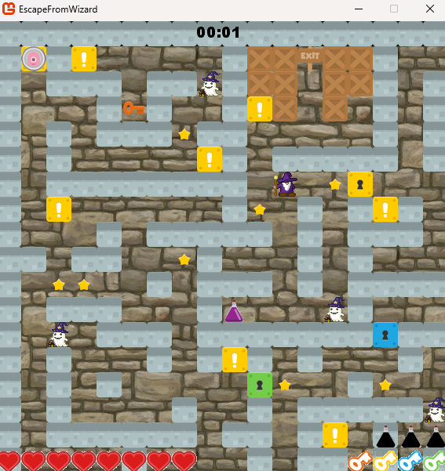
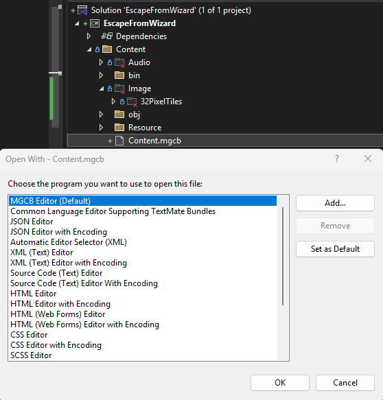
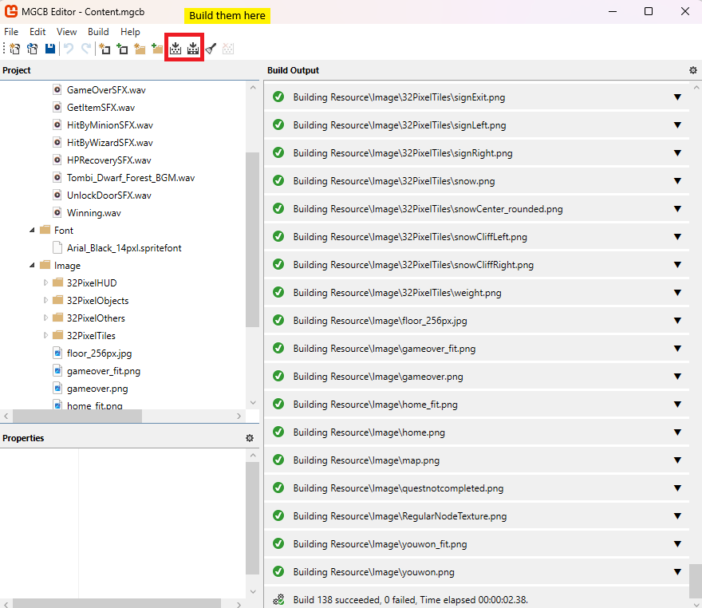

# escape-from-wizard


Escape from Wizard is a classic dungeon-escape style game where the player must:

- Navigate through a maze-like map.

- Collect key items scattered around.

- Avoid being caught by roaming Hat Ghosts and the pursuing Wizard.

- Once all key items are collected, quickly locate the exit to achieve victory.

This was originally a university project for `Game Algorithm Design and Analysis` using `C#`, [Microsoft XNA 4.0](https://en.wikipedia.org/wiki/Microsoft_XNA_Game_Studio#:~:text=Microsoft%20XNA%20Game%20Studio%20is,on%20the%20Microsoft%20XNA%20platform.), managed with `TFS`, now migrated to `GitHub` and modernized with **CI/CD**.


<p align="center">
  
</p>

## ✨ Features

- Classic dungeon escape gameplay with collectibles and enemy chasers.

- Implementation of `A*` algorithm for intelligent pathfinding.

- Key upgrades:
  - Ported from `Microsoft XNA 4.0` (VS2015) to `MonoGame` (VS2022).
  - Modernized with solution generation with scripts
  - Migrated and automated content generation pipeline with `MGCB`.
  - Added debug functions for testing and level exploration.
  - Added CI/CD workflows with GitHub Actions to build, test, and publish artifacts for `Windows` and `Linux`.

## Project Structure

```bash
escape-from-wizard/
├── .github/workflows/                  # GitHub Actions CI/CD pipelines
├── img/                                # Project screenshots & documentation images
├── script/                             # Helper scripts
├── src/                                # Main source code and content  (C#, MonoGame)
│ ├── Game/Content/                     # Game content pipeline (MGCB, assets)
│ ├── Game/Source/                      # Game logic, entities, algorithms
│ └── escape-from-wizard.csproj
└── README.md                           # Project documentation
```

## Project Setup

### Step 1: Generate Solution

Execute the `generate-sln` script depending on the operating system.

**Windows**:

```bash
./script/generate-sln.ps1
```

**Linux**:

```bash
./script/generate-sln.sh
```

### Step 2: Generate Content

Execute the `generate-content` script depending on the operating system.

#### Windows

```bash
./script/generate-content.ps1
```

#### Linux

```bash
./script/generate-content.sh
```

#### Manual Generation

Open `Content.mgcb` with MGCB Editor with the generated solution, and build for the desired platform.
The binaries will be generated at `src/bin/$(Platform)` and `src/obj/$(Platform)`. 

<p align="center">
    
    
</p>

For more information, kindly refer to [Generating .xnb files](https://www.trccompsci.online/mediawiki/index.php/Generating_and_using_XNB_files).

## Running Project

### Game Control

`←` `→` `↑` `↓` or `w` `a` `s` `d` to move around.

### Game Objects

| Feature | Description |
|--|--|
| Hiding Tiles (!) | Entering makes the wizard lose sight; pushes the character out after a delay |
| Star | Increases score |
| Wizard | Deal major contact damage |
| Ghost | Deal minor contact damage |
| Purple Potion | Mantatory Quest item (Collect 3) |
| Red Potion | Restores health |
| Colored Door | Blocks player path. Destroy on passing through with its key.|
| Colored Key | Unlocks corresponding color door |
| Exit Sign | Reach it to win |
| Esc | Quit game |

### Debug Functions

| Key | Desciption |
|--|--|
|`F1` | Toggle God Mode|
|`F2` | Full Heals|
|`F3` | Obtained All Keys|
|`F4` | Obtained All Quest Items|
|`F5` | Unlock All Doors|
|`F6` | Toggle Guide Lines|
